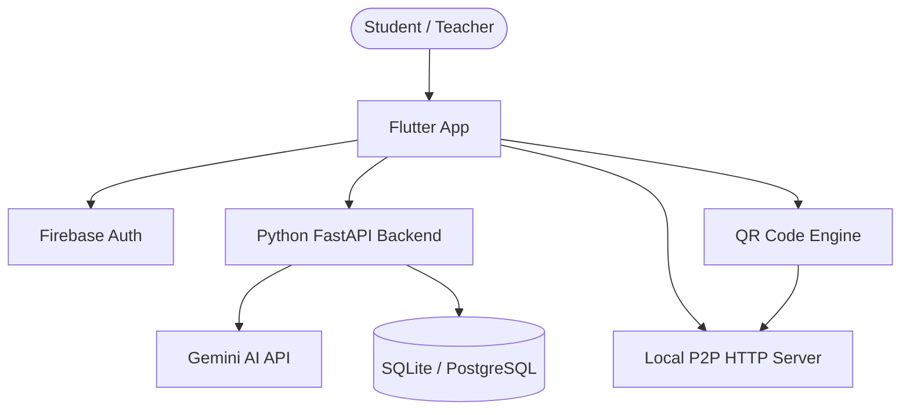

# Smart India Hackathon 2025 — Vidyarthi

[](https://github.com/MasterJi27/Smart-India-Hackathon-2025/actions)


> **Vidyarthi** is a lightweight Flutter application built to digitalize and modernize the rural education system in India. It provides AI-powered study tools, offline-friendly document sharing, and a complete teacher management suite — all in a single app.

---

## ✨ Features

### 👨‍🎓 Student Tools

| Feature | Description |
|---|---|
| **AI Notes** | Generate structured study notes on any topic using Gemini AI |
| **Saved Notes** | Organize and browse your personal notes library |
| **Photomath** | Point your camera at a handwritten equation and get the solution (Google ML Kit OCR) |
| **Timetable** | Create and manage your class schedule |
| **QR Note Import** | Scan a QR code to instantly receive notes from a classmate |
| **Handwritten Scan** | Scan handwritten pages with a CamScanner-quality magic filter and export as a compressed PDF |
| **NCERT E-Books** | Browse and read NCERT textbooks in-app via WebView |

### 👩‍🏫 Teacher Dashboard

| Feature | Description |
|---|---|
| **Student Management** | Add, edit, and delete students; assign them to classes |
| **Class Management** | Create and organize class sections by grade |
| **Attendance** | Mark daily attendance with a date picker and checkbox interface |
| **Lesson Planner** | Create lesson plans with optional AI-generated summaries |
| **Analytics** | View attendance percentages and marks distribution (A/B/C/D) per class |

### 📡 Sharing & Connectivity

- **Smart QR Sharing** — small content is gzip-compressed and embedded directly in the QR code; large files automatically fall back to P2P mode
- **P2P File Transfer** — share PDFs over a local Wi-Fi / mobile hotspot with no internet required
- **Offline-first** — core features work without an internet connection

---

## 🏗️ Architecture



---

## 🛠️ Tech Stack

| Layer | Technology |
|---|---|
| **Mobile App** | Flutter 3.x (Dart) |
| **Backend** | Python 3.11, FastAPI, SQLAlchemy |
| **Authentication** | Firebase Auth, Google Sign-In |
| **AI** | Google Gemini 2.5 Flash |
| **OCR / ML** | Google ML Kit (text recognition, digital ink) |
| **QR Codes** | `qr_flutter` (generate), `mobile_scanner` (scan) |
| **PDF** | `pdf`, `printing`, `pdfx` |
| **CI/CD** | GitHub Actions |
| **Containerization** | Docker |

---

## 🚀 Getting Started

### Prerequisites

- Flutter SDK ≥ 3.4.0 (`flutter --version`)
- Python 3.10+
- A Firebase project (for Authentication)
- A Gemini API key

### 1. Clone & install Flutter dependencies

```bash
git clone https://github.com/MasterJi27/Smart-India-Hackathon-2025.git
cd Smart-India-Hackathon-2025
flutter pub get
```

### 2. Configure environment variables

Copy the example file and fill in your keys:

```bash
cp .env.example .env
```

| Variable | Description |
|---|---|
| `GEMINI_API_KEY` | Google Gemini API key (required by backend) |
| `OPENROUTER_API_KEY` | Optional alternative AI provider |
| `JWT_SECRET` | Secret for signing session tokens |
| `DATABASE_URL` | Database connection string |
| `PORT` | Backend server port (default `3000`) |

> **Note:** Never commit your `.env` file. It is already listed in `.gitignore`.

### 3. Add Firebase config

Place your `google-services.json` (Android) and `GoogleService-Info.plist` (iOS) in the appropriate platform directories. These files are excluded from version control.

### 4. Run the Flutter app

```bash
# Android / iOS device
flutter run

# Chrome (tablet / web testing)
flutter run -d chrome --web-port=8080

# Release APK
flutter build apk --release
```

### 5. Start the backend

```bash
cd backend
pip install -r requirement.txt
uvicorn main:app --host 0.0.0.0 --port 8000 --reload
```

The API will be available at `http://localhost:8000`. Interactive docs are at `http://localhost:8000/docs`.

### 6. Docker (optional)

```bash
docker build -t sih-2025 .
docker run -p 8000:8000 --env-file .env sih-2025
```

---

## 🧪 Testing

```bash
# Flutter unit & widget tests
flutter test

# Static analysis
flutter analyze

# Backend smoke test
curl -X POST http://localhost:8000/generate-note \
  -H "Content-Type: application/json" \
  -d '{"subject": "Science", "topic": "Photosynthesis"}'
```

---

## 🔐 Security Highlights

- Salted SHA-256 password hashing (migration to bcrypt/argon2 recommended for production)
- 24-hour session token expiry
- Client-side and server-side input sanitization (XSS / SQL injection detection)
- Rate limiting on login (client) and all API endpoints (server via `slowapi`)
- Restricted CORS configuration
- Weak password blacklist enforced at sign-up

See [`SECURITY_AUDIT_REPORT.md`](SECURITY_AUDIT_REPORT.md) for the full audit (score: **7.7 / 10**).

---

## 📁 Project Structure

```
├── lib/
│   ├── core/           # Utilities, security helpers, responsive layout
│   ├── models/         # Data models
│   ├── screens/        # All UI screens (student + teacher)
│   │   └── teacher/    # Teacher dashboard screens
│   ├── services/       # API, Firebase, P2P, QR services
│   └── widgets/        # Reusable UI components
├── backend/            # Python FastAPI backend
│   ├── main.py         # API routes & Gemini integration
│   ├── auth.py         # Authentication routes
│   ├── database.py     # SQLAlchemy models & DB setup
│   └── rate_limiter.py # API rate limiting
├── assets/             # Images, icons, language files
└── test/               # Flutter tests
```

---

## 🤝 Contributing

1. Fork the repository
2. Create a feature branch: `git checkout -b feature/my-feature`
3. Commit your changes: `git commit -m "feat: add my feature"`
4. Push and open a Pull Request

---

## 📄 License

This project is licensed under the terms of the [LICENSE](LICENSE) file in the repository root.
